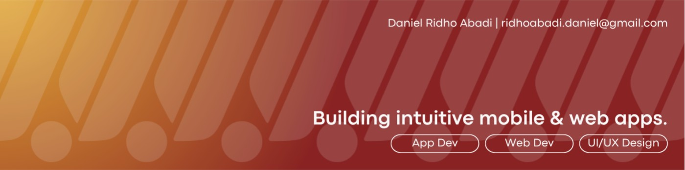

<!-- Replace this with your own banner image -->

 

# Hi, I'm Daniel Ridho Abadi 👋

### UI/UX Designer & Software Developer

I design user-centered digital experiences and turn ideas into functional mobile and web applications.

My main interests are **UI/UX design**, **mobile application development**, and creating digital products that provide meaningful value and social impact.

 

---

## About Me

I am a cum laude Informatics graduate from **Universitas Pembangunan Nasional “Veteran” Yogyakarta** with an interest in designing and developing useful digital products.

I enjoy understanding user problems, conducting research, designing intuitive interfaces, and translating ideas into mobile or web applications. My goal is to create mature and deployable products that are not only visually appealing, but also easy to understand and genuinely useful for their users.

I am particularly interested in products with social impact, including solutions related to public transportation, accessibility, public services, and everyday user needs.

My working style can be described as **creative, relaxed but critical, and communicative**. I am comfortable working independently, collaborating with multidisciplinary teams, and coordinating projects when needed.

---

## What I Do

### UI/UX Design

* User flow development
* Wireframing
* Mobile interface design
* Responsive web interface design
* Interactive prototyping
* Figma components and Auto Layout
* Basic user research
* Basic usability testing
* Basic persona and user journey development
* User-centered design

### Mobile Development

* Cross-platform application development using Flutter
* Mobile interface implementation
* Navigation and routing
* Form development and validation
* API integration
* Authentication
* Local storage
* Database integration
* Maps and location-based functionality
* Application deployment

### Web Development

* Responsive web interface development
* React-based interface fundamentals
* HTML, CSS, and JavaScript fundamentals
* PHP backend development
* CRUD functionality
* Authentication and login systems
* Form processing
* Database integration
* Basic Laravel development

---

## Tools and Technologies

### Design

  

### Mobile Development

  

### Web Development

  

### Database and Backend Services

  

### Development Tools

  

---

## Skills Overview

| Area                    | Current Capability |
| ----------------------- | ------------------ |
| Mobile UI Design        | Confident          |
| Interactive Prototyping | Confident          |
| User Flow Design        | Intermediate       |
| Wireframing             | Confident          |
| Responsive UI Design    | Intermediate       |
| Design Systems          | Intermediate       |
| Flutter Development     | Intermediate       |
| HTML and CSS            | Intermediate       |
| PHP Development         | Intermediate       |
| JavaScript              | Fundamental        |
| React                   | Fundamental        |
| Laravel                 | Fundamental        |
| Git and GitHub          | Developing         |
| User Research           | Fundamental        |
| Usability Testing       | Fundamental        |

I continuously improve my technical skills while maintaining a strong focus on user experience, interface quality, and product usefulness.

---

## Featured Projects

### 1. Project Name

> A concise one- or two-sentence description explaining the problem, the proposed solution, and the main value of the project.

**Project Type:** Self-Initiated / Academic / Group Project
**Role:** UI/UX Designer, Mobile Developer, or Project Manager
**Technologies:** Flutter, Dart, Figma, Supabase
**Status:** Completed / In Development

#### My Contribution

* Designed the user flow and mobile interface.
* Developed interactive prototypes in Figma.
* Implemented selected application features.
* Collaborated with team members during development.
* Contributed to product planning and evaluation.

#### Key Learning

This project helped me improve my ability to translate user problems into structured product flows, interface designs, and functional application features.

[View Repository](https://github.com/DanielRidho/PROJECT-REPOSITORY) ·
[View Case Study](#) ·
[View Prototype](#)

---

### 2. Project Name

> A concise description explaining the purpose of the project, its intended users, and the solution that was developed.

**Project Type:** Group Project
**Role:** UI/UX Designer and Front-End Contributor
**Technologies:** Figma, React, JavaScript, CSS
**Status:** Completed

#### My Contribution

* Led or contributed to the UI/UX design process.
* Created wireframes and high-fidelity interfaces.
* Developed an interactive prototype.
* Supported front-end implementation.
* Communicated design decisions with team members.

#### Key Learning

This project strengthened my ability to collaborate under deadlines, communicate design decisions, and maintain consistency between design and implementation.

[View Repository](https://github.com/DanielRidho/PROJECT-REPOSITORY) ·
[View Prototype](#)

---

### 3. Project Name

> A short description of the system, the business problem it addresses, and the functionality developed by the team.

**Project Type:** Academic Group Project
**Role:** Project Manager
**Methodology:** Agile / Waterfall / SDLC
**Status:** Completed

#### My Contribution

* Coordinated the project workflow.
* Helped define system requirements.
* Managed task distribution and team communication.
* Monitored progress and project deliverables.
* Supported product evaluation and documentation.

#### Key Learning

This project helped me understand how software products are planned, divided into manageable tasks, and developed through collaboration across different roles.

[View Repository](https://github.com/DanielRidho/PROJECT-REPOSITORY) ·
[View Documentation](#)

---

### 4. Project Name

> A brief explanation of the project, including its target users, core idea, and intended impact.

**Project Type:** Self-Initiated Project
**Role:** Product Designer and Developer
**Technologies:** Figma, Flutter, Dart
**Status:** In Development

#### My Contribution

* Identified the main user problem.
* Developed the product concept.
* Designed the user experience and visual interface.
* Built selected application features.
* Planned future development and deployment.

#### Key Learning

This project taught me to balance creativity, user needs, technical limitations, and long-term product development.

[View Repository](https://github.com/DanielRidho/PROJECT-REPOSITORY) ·
[View Case Study](#)

---

## Development Approach

I have experience working with several software and design approaches:

* User-Centered Design
* Agile development
* Waterfall development
* Software Development Life Cycle
* Collaborative team development
* Individual product development

I prefer starting from a clear understanding of the user problem before defining the interface, system flow, and technical implementation.

---

## GitHub Statistics

> GitHub statistics represent repository activity and code composition. They do not represent overall proficiency in a technology.

---

## Resume

You can view or download my resume below.

---

## Let's Connect

I am interested in connecting with designers, developers, and people who are passionate about building meaningful digital products.

* **Email:** [ridhoabadi.daniel@gmail.com](mailto:ridhoabadi.daniel@gmail.com)
* **LinkedIn:** [Daniel Ridho Abadi](https://www.linkedin.com/in/danielridhoabadi/)
* **Instagram:** [@danielridhoabadi](https://www.instagram.com/danielridhoabadi)
* **Portfolio:** Coming soon

### Designing useful experiences, one idea at a time.

